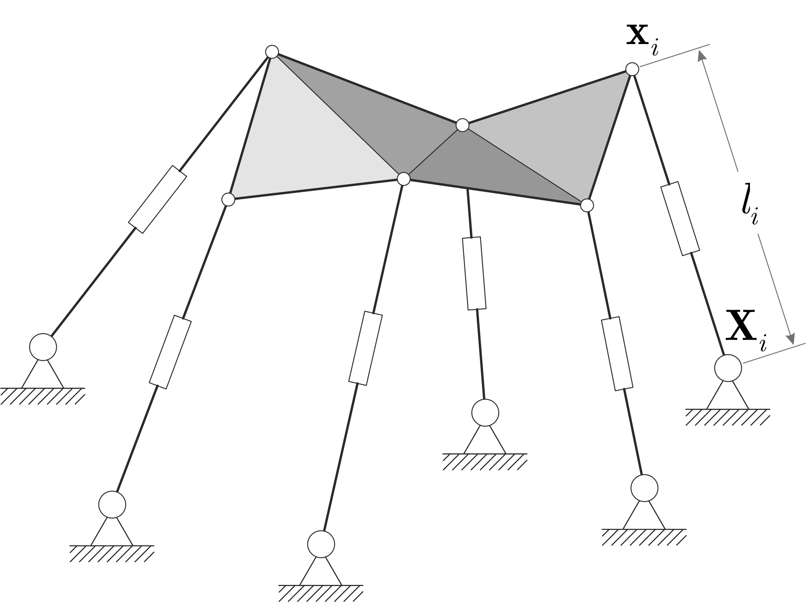

# Forward kinematics of a general Stewart-Gough platform

A Stewart-Gough platform (SGP) is a parallel manipulator widely used in applications such as flight simulators, robotic manipulators, haptic devices, surgical robots, radio telescopes, etc. It consists of a fixed base and a movable platform linked by six independently extensible legs. Each leg is attached to both the base and the platform via spherical joints, allowing for a wide range of motion, see Figure. The leg lengths are typically adjusted using actuators - such as hydraulic or pneumatic cylinders - allowing precise control over the platform's position and orientation

The general SGP makes no assumptions about planarity or symmetry in either the fixed base or movable platform. This fully parallel mechanism has six degrees of freedom, meaning it can move in three translational directions and three rotational directions (pitch, roll, yaw). This allows the platform to move freely in 3-dimensional space.

  

  <em>The general Stewart-Gough platform</em>

The forward kinematics problem for a Stewart-Gough platform involves determining the position and orientation of the movable platform given the lengths of the six extensible legs and the internal geometries of the platform and base. This problem is inherently complex due to the parallel structure of the platform, resulting in a system of non-linear polynomial equations. It has been shown that the problem has exactly 40 solutions in complex space.

This repository contains MATLAB, Julia, and Python implementations of the elimination template based solution to the forward kinematics problem for a general SGP. Key advantages:
* computation of all 40 solutions (real and complex);
* simultaneous maintenance of numerical accuracy and computational efficiency;
* reliance on standard linear algebra decompositions (PLU and QZ);
* extension to two special SGP cases (6-5 and 6P-6) without modification.

If you use this code in your research, please cite the following paper:

@article{martyushev2025forward, 
&nbsp;&nbsp;&nbsp; title={Forward kinematics of a general Stewart--Gough platform by elimination templates}, 
&nbsp;&nbsp;&nbsp; author={Martyushev, Evgeniy}, 
&nbsp;&nbsp;&nbsp; journal={https://arxiv.org/abs/2505.00634}, 
&nbsp;&nbsp;&nbsp; volume={}, 
&nbsp;&nbsp;&nbsp; number={}, 
&nbsp;&nbsp;&nbsp; pages={}, 
&nbsp;&nbsp;&nbsp; year={2025}, 
}

The implementations have been tested on
* MATLAB R2019b
* Julia 1.11.3
* Python 3.13.2 + numpy-2.2.2 + scipy-1.15.1