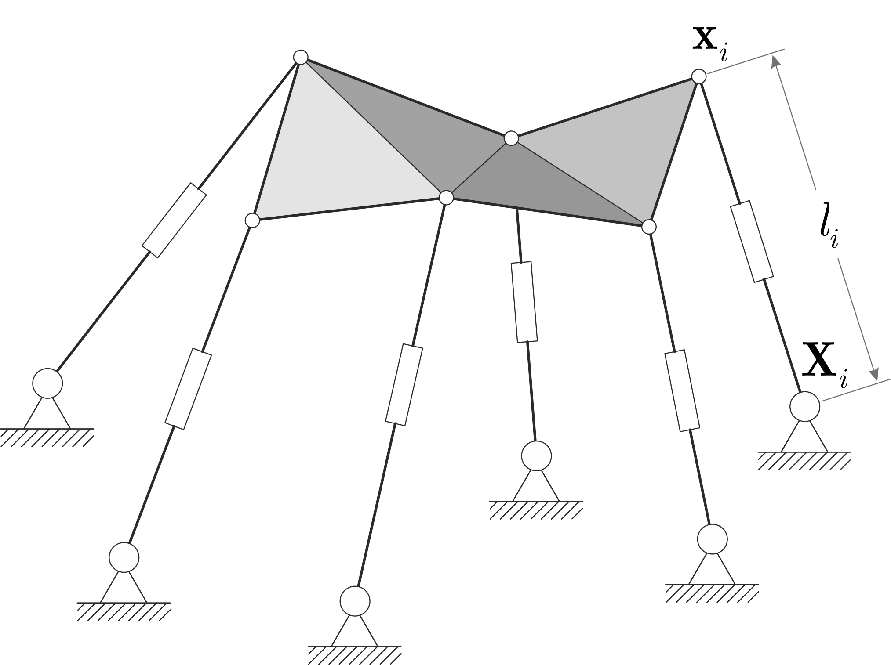

# Forward kinematics of a general Stewart-Gough platform

  
  <em>General Stewart-Gough platform</em>

MATLAB/Julia/Python implementations of the algoritm from

@article{martyushev2025forward, 
&nbsp;&nbsp;&nbsp; title={Forward kinematics of a general Stewart--Gough platform by elimination templates}, 
&nbsp;&nbsp;&nbsp; author={Martyushev, Evgeniy}, 
&nbsp;&nbsp;&nbsp; journal={}, 
&nbsp;&nbsp;&nbsp; volume={}, 
&nbsp;&nbsp;&nbsp; number={}, 
&nbsp;&nbsp;&nbsp; pages={}, 
&nbsp;&nbsp;&nbsp; year={2025}, 
&nbsp;&nbsp;&nbsp; publisher={} 
}

If you use this code, please cite the above paper.

The implementations have been tested on
* MATLAB R2019b
* Julia 1.11.3
* Python 3.13.2 + numpy-2.2.2 + scipy-1.15.1